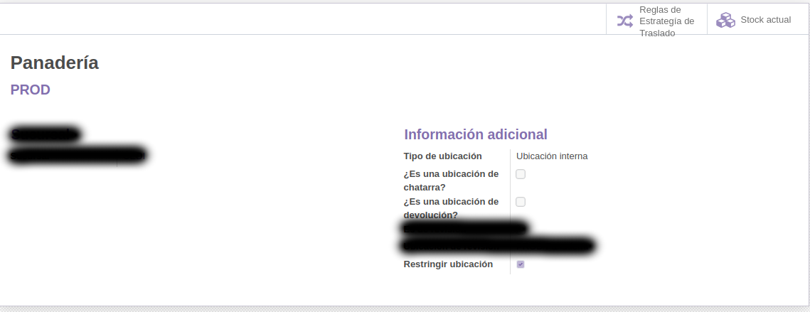
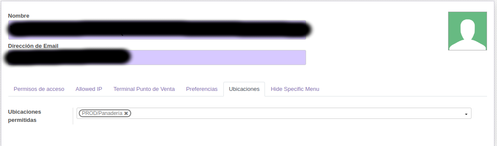

# Odoo: odoo_restrict_locations

####    This module allows you to mark locations as restricted

This module allows you to mark locations as restricted, then from the user file you can indicate which of these locations the user will have access to.

